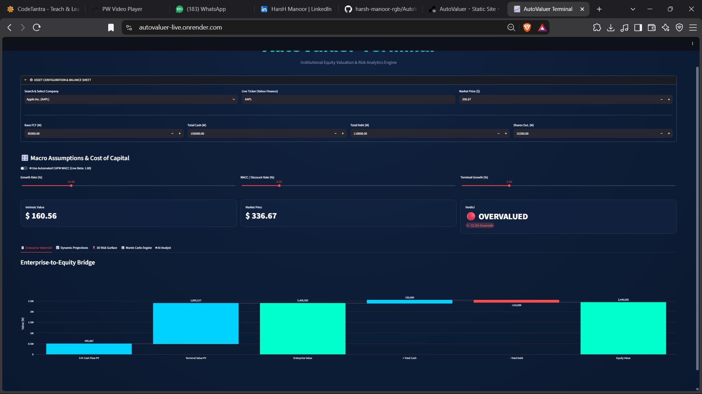

# AutoValuer Terminal

**Institutional equity valuation and risk analytics engine, built with Python and Streamlit.**

AutoValuer estimates what a stock is really worth using a **Discounted Cash Flow (DCF)** model, then compares that value with the current market price to say whether the stock looks **undervalued** or **overvalued**. It also stress-tests the result with risk simulations, so you can see how sensitive the answer is to your assumptions.

**Live demo:** https://autovaluer-live.onrender.com/
(The app is hosted on a free plan, so the first load may take about a minute while it wakes up.)



---

## What it does

- **DCF valuation:** Projects a company's free cash flow for 5 years, adds a terminal value (Gordon Growth method), and discounts everything back to today using WACC.
- **Live market data:** Pulls the current share price and company data from Yahoo Finance using a ticker symbol (for example, AAPL).
- **Automated CAPM / WACC:** Can estimate the discount rate automatically from the stock's live beta, or you can set it yourself with sliders.
- **Enterprise-to-Equity bridge:** A waterfall chart showing how the value builds up from cash flows to enterprise value, then to equity value after adding cash and subtracting debt.
- **Dynamic projections:** Interactive charts of projected cash flows.
- **3D risk surface and risk matrix:** Shows how the valuation changes as WACC and growth assumptions change.
- **Monte Carlo engine:** Runs 10,000 simulated scenarios to show the probability of different valuation outcomes.
- **AI Analyst tab:** A plain-English explanation of the result.
- **Preset companies:** Quick selection of well-known companies, or enter any custom ticker.

## Example output

Using Apple Inc. (AAPL) with the default assumptions in the app:

| Input | Value |
|---|---|
| Base free cash flow | $95,000M |
| Total cash | $150,000M |
| Total debt | $110,000M |
| Shares outstanding | 15,200M |
| Growth rate | 10% |
| WACC (discount rate) | 8.5% |
| Terminal growth | 3% |

| Result | Value |
|---|---|
| Intrinsic value per share | $160.56 |
| Market price | $336.67 |
| Verdict | Overvalued (about 52% downside) |

This is an illustration of how the tool works. The result depends heavily on the assumptions chosen, which is why the app includes the risk surface and Monte Carlo simulation.

## How the valuation works

1. Project free cash flow for 5 years using the growth rate.
2. Calculate the terminal value using the Gordon Growth formula.
3. Discount all cash flows to today's value using WACC.
4. Enterprise value = present value of cash flows + present value of terminal value.
5. Equity value = enterprise value + cash - debt.
6. Intrinsic value per share = equity value / shares outstanding.

## Tech stack

- **Python**
- **Streamlit** (web app)
- **Plotly** (interactive charts)
- **Yahoo Finance** data via `yfinance`
- Deployed on **Render**

## Project structure

| File | Purpose |
|---|---|
| `app.py` | The Streamlit web app (user interface and charts) |
| `dcf_engine.py` | The DCF calculation logic |
| `requirements.txt` | List of Python libraries needed |

## Run it on your own computer

1. Install Python from python.org.
2. Download this repository (green **Code** button, then **Download ZIP**) and unzip it.
3. Open a terminal in that folder and install the libraries:
   ```
   pip install -r requirements.txt
   ```
4. Start the app:
   ```
   streamlit run app.py
   ```
5. Your browser will open the app automatically.

## Disclaimer

This project is for learning and demonstration only. It is **not investment advice**. A DCF valuation is only as reliable as the assumptions behind it.

## Author

**Harshdeep Singh**, BSc Economics (Hons), Lovely Professional University
LinkedIn: https://www.linkedin.com/in/harsh-manoor

Special thanks to Ajitesh and Jai (Gemini).
